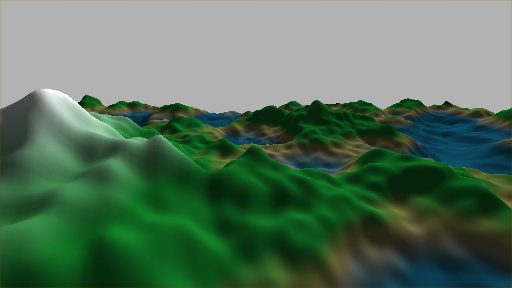
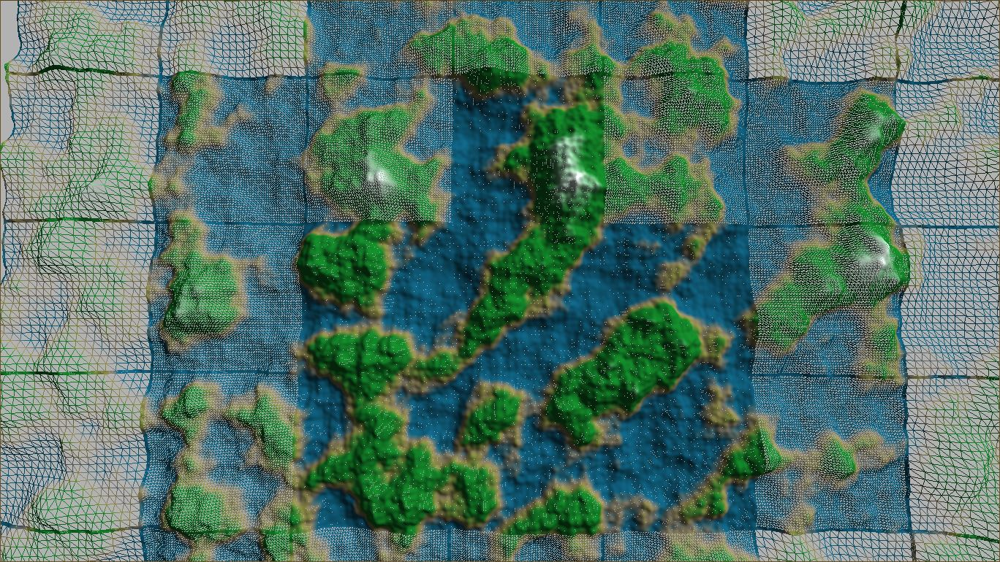

# Endless-Terrain
This is a Computer Graphics Project on Endless Terrain Generation with LOD's Switching (for optimization). Developed in C++ and OpenGL (Supported for OpenGL 3.3+). A demo video of procedural world can be found [here](https://youtu.be/NynwXLmo1Oc)

### LOD Switching

### Controls

- `Esc`: Exit Application

#### Mod

- `1`: wireframe mode
- `2`: shaded mode

#### Camera Movements

- `W/A/S/D`: Move around the scene
- `Shift + W/A/S/D`: Fast Movement speed
